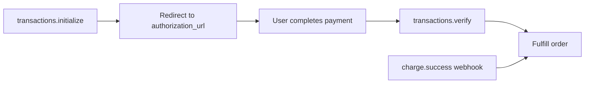

## Initialize

```ts title="lib/paystack.ts"
import { Paystack } from "@g14o/paystack";
import { env } from "@/lib/env";

const paystack = new Paystack({
  secretKey: env.PAYSTACK_SECRET_KEY,
  publicKey: env.PAYSTACK_PUBLIC_KEY, // optional — client-side Popup
});
```

`secretKey` is required for server-side API calls and webhook HMAC verification. Optional settings include `baseUrl`, `fetch`, `maxRetries` (default `3`), and `timeoutMs` (default `30000`). When set, `publicKey` is also exposed as `paystack.publicKey` for Paystack Popup integrations.

See [API reference](/docs/packages/paystack/api) for the full `PaystackClientOptions` table.

## Payment flow

`transactions.initialize` only **starts** checkout. Always confirm payment server-side with `transactions.verify` or a [`charge.success` webhook](/docs/packages/paystack/webhooks) before delivering value.



## Transactions

Namespace: `paystack.transactions.*` — maps to Paystack `/transaction` endpoints.

| Method | Endpoint | Returns | Use case |
| --- | --- | --- | --- |
| `initialize(params)` | `POST /transaction/initialize` | `PaystackInitializeTransaction` | Start hosted checkout. Returns `authorization_url`, `access_code`, and `reference`. Amount is in currency subunits (e.g. `1500` = GHS 15.00). |
| `verify(reference)` | `GET /transaction/verify/:reference` | `PaystackTransaction` | Confirm payment status after callback or before fulfillment. Check `status === "success"`. |
| `chargeAuthorization(params)` | `POST /transaction/charge_authorization` | `PaystackTransaction` | Charge a saved card using a reusable `authorization_code` from a prior successful charge. |

### Initialize checkout

```ts
const checkout = await paystack.transactions.initialize({
  email: "user@example.com",
  amount: 1500,
  currency: "GHS",
  callback_url: "https://app.example.com/callback",
  metadata: { order_id: "ord_123" },
});

// Redirect the user to checkout.authorization_url
```

Pass an optional `plan` code to start a subscription checkout, or `reference` to use your own transaction reference.

Param types: [InitializeTransactionParams](/docs/packages/paystack/api#initializetransactionparams).

### Verify payment

```ts
const tx = await paystack.transactions.verify(reference);

if (tx.status === "success") {
  // Fulfill the order
}
```

### Charge saved authorization

```ts
const tx = await paystack.transactions.chargeAuthorization({
  email: "user@example.com",
  amount: 1500,
  authorization_code: "AUTH_xxx",
  currency: "GHS",
});
```

Param types: [ChargeAuthorizationParams](/docs/packages/paystack/api#chargeauthorizationparams).

## Customers

Namespace: `paystack.customers.*` — maps to Paystack `/customer` endpoints.

| Method | Endpoint | Returns | Use case |
| --- | --- | --- | --- |
| `create(params)` | `POST /customer` | `PaystackCustomer` | Register a customer before checkout or subscription. Requires `email`. |
| `fetch(emailOrCode)` | `GET /customer/:emailOrCode` | `PaystackCustomer` | Look up a customer by email or `customer_code` (e.g. `CUS_xxx`). |
| `list(query?)` | `GET /customer` | `PaystackCustomer[]` | Paginate customers. Optional `perPage`, `page`. |
| `update(customerCode, params)` | `PUT /customer/:code` | `PaystackCustomer` | Update name, phone, or metadata. |

```ts
const customer = await paystack.customers.create({
  email: "user@example.com",
  first_name: "Ada",
  last_name: "Lovelace",
});

const fetched = await paystack.customers.fetch(customer.customer_code);
const page = await paystack.customers.list({ perPage: 25, page: 1 });

await paystack.customers.update(customer.customer_code, {
  phone: "+233200000000",
});
```

`PaystackCustomer` includes `customer_code`, `authorizations[]` (saved cards), and metadata — useful before calling `chargeAuthorization` or `subscriptions.create`.

Param types: [CreateCustomerParams](/docs/packages/paystack/api#createcustomerparams).

## Plans

Namespace: `paystack.plans.*` — maps to Paystack `/plan` endpoints.

| Method | Endpoint | Returns | Use case |
| --- | --- | --- | --- |
| `create(params)` | `POST /plan` | `PaystackPlan` | Define a recurring billing plan. Requires `name`, `amount`, `interval`. |
| `fetch(idOrCode)` | `GET /plan/:idOrCode` | `PaystackPlan` | Look up a plan by numeric ID or `plan_code`. |
| `list(query?)` | `GET /plan` | `PaystackPlan[]` | Paginate plans. Optional `perPage`, `page`. |

```ts
const plan = await paystack.plans.create({
  name: "Pro Monthly",
  amount: 5000,
  interval: "monthly",
  currency: "GHS",
});

const byCode = await paystack.plans.fetch(plan.plan_code);
const plans = await paystack.plans.list({ perPage: 10, page: 1 });
```

Monthly and annual billing require **separate plan codes** — create distinct plans per interval.

Param types: [CreatePlanParams](/docs/packages/paystack/api#createplanparams).

## Subscriptions

Namespace: `paystack.subscriptions.*` — maps to Paystack `/subscription` endpoints.

| Method | Endpoint | Returns | Use case |
| --- | --- | --- | --- |
| `create(params)` | `POST /subscription` | `PaystackSubscription` | Subscribe a customer to a plan. Requires `customer` and `plan` codes. Returns `email_token` for disable/enable. |
| `fetch(code)` | `GET /subscription/:code` | `PaystackSubscription` | Look up status, next payment date, and linked plan/customer. |
| `disable(params)` | `POST /subscription/disable` | `unknown` | Cancel a subscription. Requires `code` and `token` (`email_token`). |
| `enable(params)` | `POST /subscription/enable` | `unknown` | Re-enable a disabled subscription. Same params as `disable`. |
| `list(query?)` | `GET /subscription` | `PaystackSubscription[]` | List subscriptions. Filter by `customer` (ID) or `plan` (ID). Paginate with `perPage`, `page`. |

```ts
const subscription = await paystack.subscriptions.create({
  customer: customer.customer_code,
  plan: plan.plan_code,
});

// Store email_token securely — required for disable/enable
const { subscription_code, email_token } = subscription;

await paystack.subscriptions.disable({
  code: subscription_code,
  token: email_token!,
});

const active = await paystack.subscriptions.list({
  customer: customer.id,
  perPage: 10,
});
```

Param types: [CreateSubscriptionParams](/docs/packages/paystack/api#createsubscriptionparams), [DisableSubscriptionParams](/docs/packages/paystack/api#disablesubscriptionparams).

## End-to-end workflow

```ts
const customer = await paystack.customers.create({ email: "user@example.com" });

const plan = await paystack.plans.create({
  name: "Pro Monthly",
  amount: 5000,
  interval: "monthly",
  currency: "GHS",
});

const checkout = await paystack.transactions.initialize({
  email: customer.email,
  amount: plan.amount,
  plan: plan.plan_code,
  callback_url: "https://app.example.com/callback",
});

const tx = await paystack.transactions.verify(checkout.reference);

const sub = await paystack.subscriptions.create({
  customer: customer.customer_code,
  plan: plan.plan_code,
});
```

## Error handling

The client throws structured errors for API failures, validation, network issues, rate limits, and timeouts.

| Error | Code | When |
| --- | --- | --- |
| `PaystackError` | `PAYSTACK_API_ERROR` | Paystack API returned `status: false` |
| `PaystackError` | `PAYSTACK_VALIDATION_ERROR` | Invalid request payload or response shape |
| `PaystackError` | `PAYSTACK_NETWORK_ERROR` | Network failure |
| `PaystackError` | `PAYSTACK_RATE_LIMIT` | Rate limited |
| `PaystackError` | `PAYSTACK_TIMEOUT` | Request timed out |

Webhook-specific errors (`WebhookVerificationError`, `WEBHOOK_PROCESSING_ERROR`) are documented on the [Webhooks](/docs/packages/paystack/webhooks) page.

See [API reference](/docs/packages/paystack/api) for full type tables.
