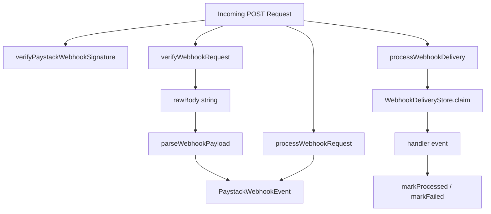

Paystack sends event notifications to your webhook URL as signed JSON POST requests. Always verify the `x-paystack-signature` header against the **raw request body** before parsing JSON or delivering value.

## Processing flow



Re-serializing JSON after reading the body will break signature verification — use the exact bytes Paystack sent.

## Client webhook APIs

Namespace: `paystack.webhook.*` on a `Paystack` client instance (uses the configured `secretKey` for HMAC-SHA512).

| Method | Use case |
| --- | --- |
| `verifyPaystackWebhookSignature(rawBody, signature)` | Manual verification when you already have the raw body and `x-paystack-signature` header. Throws `WebhookVerificationError`. |
| `verifyWebhookRequest(request)` | Web `Request` handler — validates body and header, reads `request.text()`, verifies signature, returns the raw body string. |
| `parseWebhookPayload(rawBody)` | Parse JSON and Zod-validate into a typed `PaystackWebhookEvent`. Call only after verification. |
| `processWebhookRequest(request)` | Verify + parse in one call. Best for simple handlers without deduplication. |
| `processWebhookDelivery(request, options)` | Verify + parse + run `handler` with optional deduplication via `WebhookDeliveryStore`. Best for production routes. |

### Verify signature manually

```ts
paystack.webhook.verifyPaystackWebhookSignature(
  rawBody,
  request.headers.get("x-paystack-signature")
);
// throws WebhookVerificationError on missing/invalid signature
```

Error codes: `WEBHOOK_MISSING_SIGNATURE`, `WEBHOOK_INVALID_SIGNATURE`.

### Simple Next.js handler

```ts
import { Paystack, isPaystackEvent } from "@g14o/paystack";

const paystack = new Paystack({ secretKey: process.env.PAYSTACK_SECRET_KEY! });

export async function POST(request: Request) {
  const event = await paystack.webhook.processWebhookRequest(request);

  if (isPaystackEvent(event, "charge.success")) {
    // Fulfill order using event.data.reference
  }

  return Response.json({ received: true });
}
```

### Production handler with deduplication

```ts
const result = await paystack.webhook.processWebhookDelivery(request, {
  handler: async (event) => {
    // Business logic
  },
  store: {
    claim: async ({ eventId }) => {
      // Return "duplicate" if already processed
      return "claimed";
    },
    markProcessed: async (eventId) => {},
    markFailed: async (eventId, errorMessage) => {},
  },
});

if (result.duplicate) {
  return Response.json({ received: true, duplicate: true });
}
```

Options: [ProcessWebhookDeliveryRequestOptions](/docs/packages/paystack/api#processwebhookdeliveryrequestoptions), [WebhookDeliveryStore](/docs/packages/paystack/api#webhookdeliverystore).

### Two-step flow

Use when you need to persist the raw body before handling:

```ts
const rawBody = await paystack.webhook.verifyWebhookRequest(request);
await saveRawPayload(rawBody);
const event = paystack.webhook.parseWebhookPayload(rawBody);
```

## Standalone exports

Import from `@g14o/paystack` (not on the client instance):

| Export | Use case |
| --- | --- |
| `processWebhookDelivery(options)` | Same delivery pipeline when verification/parsing happens elsewhere (e.g. queue workers). Requires pre-verified `event` + `rawBody`. |
| `createWebhookEventId(event)` | Stable dedupe key (`eventType:reference`) from `reference`, `subscription_code`, or `id`. |
| `parsePaystackWebhookEvent(payload)` | Parse/validate without the client. Throws `ZodError` on failure. |
| `safeParsePaystackWebhookEvent(payload)` | Non-throwing parse for logging or soft validation. |
| `isPaystackEvent(event, name)` | Type-narrowing guard in handler blocks. |
| `paystackWebhookEventSchema` | Zod schema for custom validation pipelines. |
| `SUPPORTED_PAYSTACK_EVENTS` | Runtime list of all validated event names. |

```ts
import {
  createWebhookEventId,
  isPaystackEvent,
  SUPPORTED_PAYSTACK_EVENTS,
} from "@g14o/paystack";
```

## Supported event types

The package validates **27** Paystack webhook events via Zod. Each event is discriminated by the `event` field with a typed `data` payload.

| Category | Events |
| --- | --- |
| Bank transfers | `bank.transfer.rejected` |
| Charges | `charge.success` |
| Disputes | `charge.dispute.create`, `charge.dispute.remind`, `charge.dispute.resolve` |
| Customer identification | `customeridentification.failed`, `customeridentification.success` |
| Dedicated accounts | `dedicatedaccount.assign.failed`, `dedicatedaccount.assign.success` |
| Invoices | `invoice.create`, `invoice.payment_failed`, `invoice.update` |
| Payment requests | `paymentrequest.pending`, `paymentrequest.success` |
| Refunds | `refund.failed`, `refund.pending`, `refund.processed`, `refund.processing` |
| Subscriptions | `subscription.create`, `subscription.disable`, `subscription.not_renew`, `subscription.expiring_cards` |
| Transfers | `transfer.failed`, `transfer.success`, `transfer.reversed` |

Exported data types include `ChargeSuccessData`, `TransferData`, `SubscriptionCreateData`, and `PaystackEventDataMap` for typed handler code.

## Errors

| Error | Code | When |
| --- | --- | --- |
| `WebhookVerificationError` | `WEBHOOK_MISSING_SIGNATURE` | `x-paystack-signature` header absent |
| `WebhookVerificationError` | `WEBHOOK_INVALID_SIGNATURE` | HMAC mismatch |
| `PaystackError` | `PAYSTACK_VALIDATION_ERROR` | Invalid body, JSON, or event shape (400) |
| `PaystackError` | `WEBHOOK_PROCESSING_ERROR` | Handler threw during `processWebhookDelivery` (400) |

## Important constraints

- Use the same **`secretKey`** as your REST API client for HMAC verification.
- Read **`x-paystack-signature`** from headers; never parse JSON before verification.
- In Next.js, avoid middleware that consumes the request body before the route handler.
- Respond with **200** quickly; defer heavy work to a queue after verification.
- For idempotency, implement `WebhookDeliveryStore` or use [@g14o/paystack-better-auth](/docs/packages/paystack-better-auth/webhooks) built-in persistence.

## Better Auth webhooks

When using [@g14o/paystack-better-auth](/docs/packages/paystack-better-auth), configure your Paystack dashboard webhook URL to:

```
https://your-domain.com/api/auth/paystack/webhook
```

The plugin uses `processWebhookDelivery` with database-backed deduplication via `paystackWebhookEvent`.
