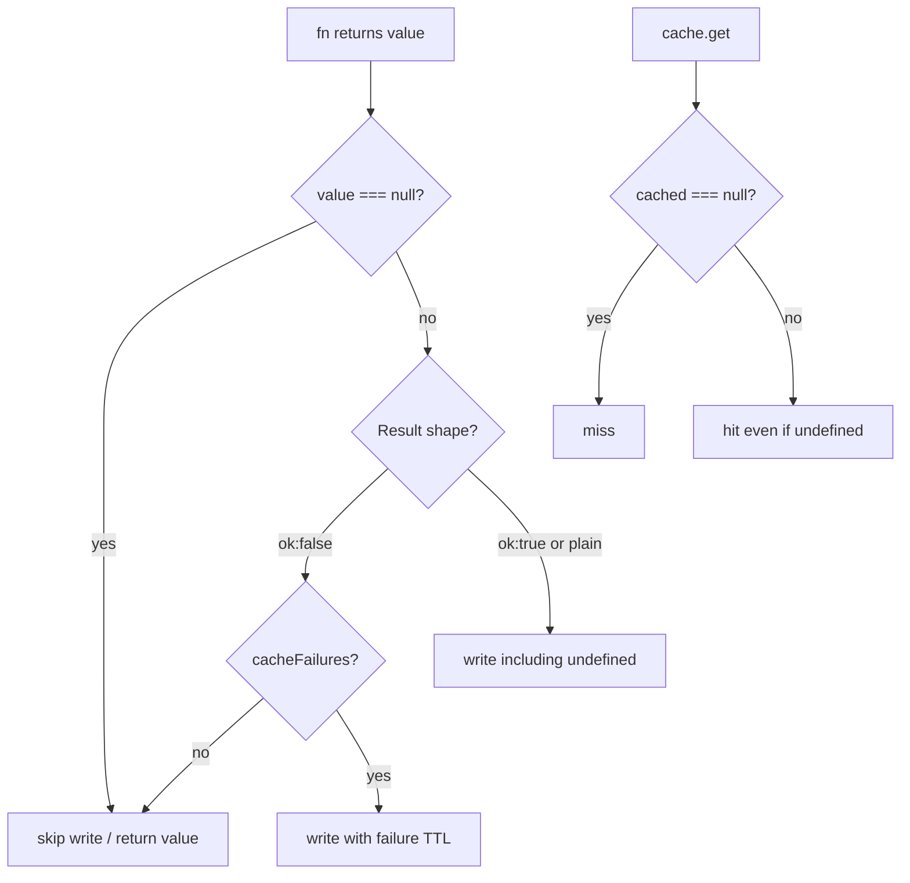

# Research: null / undefined caching in `@g14o/cache`

**Date:** 2026-08-10  
**Scope:** Primary sources only — package source, tests, in-repo README/docs.  
**Location note:** Repo has `docs/adr/` for architecture decisions and `apps/docs/` for product docs. No `RESEARCH.md`, `notes/`, or `.agents/` research convention was found. This note is saved under `packages/cache/docs/`.

---

## Executive summary

Caching nullish values is **asymmetric by design**:

| Value | `withCache` write? | `withCache` read as hit? | Store layer |
| --- | --- | --- | --- |
| `null` | **No** — skipped | Treated as **miss** (`CacheStore.get` uses `null` for missing keys) | Can store JSON `null` via direct `set`, but opaque to `withCache` |
| `undefined` | **Yes** — intentional | **Hit** (distinct from missing) | Memory / `createStore` round-trip via sentinel `__g14o_undefined__`; Upstash adapter does **not** use that sentinel |

There is **no** `get` / `set` / `fetch` / `getOrSet` high-level API on the client — the public read-through path is `withCache`. Direct store access is `getCache().get` / `.set`.

**Root cause of “undefined is cached”:** `shouldCacheValue` only rejects bare `null`; everything else (including `undefined`) returns `true`. Serialization explicitly preserves `undefined`. Docs and tests encode this as intended.

**Root cause of “null is not / cannot be cached”:** `null` is the missing-key signal on `CacheStore.get`, so `withCache` refuses to write it and treats a `null` get as a miss.

---

## 1. Public API surface (no fetch / getOrSet)

`CacheClient` exposes `withCache`, invalidation helpers, `getCache()`, TTL helpers, etc. — not a key/value `getOrSet` or `fetch` helper.

Source: `packages/cache/src/create-cache-client.ts` lines 81–160 (`CacheClient` interface).

Direct KV is the store contract:

```8:14:packages/cache/src/store/interface.ts
  get<T>(key: string): T | null | Promise<T | null>;
  // ...
  set(key: string, value: unknown, ttl?: number): void | Promise<void>;
```

---

## 2. `withCache` write path: `shouldCacheValue`

```233:245:packages/cache/src/create-cache-client.ts
function shouldCacheValue(value: unknown, cacheFailures: boolean): boolean {
  // Bare null is ambiguous with CacheStore.get's missing-key null; skip it.
  if (value === null) {
    return false;
  }
  if (isResultShape(value)) {
    if (value.ok) {
      return true;
    }
    return cacheFailures;
  }
  return true;
}
```

Claims:

1. **Bare `null` is intentionally not cached** — comment cites ambiguity with missing-key `null`.
2. **`undefined` falls through to `return true`** — so it is cached.
3. **`Result` with `ok: true` is always cacheable**, even if `data` is `null` / `undefined` (shape check only cares about `ok`).
4. Failed `Result`s cache only when `cacheFailures` is enabled.

Used on the main path and SWR background refresh:

- Main: `create-cache-client.ts` ~503–514  
- Refresh: `create-cache-client.ts` ~454–456  

---

## 3. `withCache` read path: null = miss, undefined = hit

```296:320:packages/cache/src/create-cache-client.ts
async function readCachedValue<T>(...): Promise<{ hit: T | null; stale: T | null }> {
  // ...
    const cached = await cache.get<unknown>(cacheKey);
    // Only missing keys (`null`) are misses; a stored `undefined` is a hit.
    if (cached === null) {
      logger.info(`[cache] Miss: ${cacheKey}`);
      return { hit: null, stale: null };
    }
    // ... SWR envelope or plain hit ...
    return { hit: cached as T, stale: null };
```

Caller:

```492:498:packages/cache/src/create-cache-client.ts
      if (hit !== null) {
        return hit;
      }

      if (stale !== null) {
        refreshInBackground(cacheKey, args, staleWhileRevalidate);
        return stale;
```

Claims:

1. Comment explicitly documents that **stored `undefined` is a hit**.
2. Hit/stale checks use `!== null`, so a hit value of `undefined` is returned (not treated as miss).
3. If a store ever returns `null` for a key that was “set” to `null`, `withCache` still treats it as a miss — negative caching of bare `null` is impossible with the current sentinel.

---

## 4. Store serialization: undefined sentinel (createStore / redis)

```37:52:packages/cache/src/store/create-store.ts
/** Raw sentinel so `undefined` survives string KV storage (JSON.stringify yields undefined). */
const UNDEFINED_RAW = "__g14o_undefined__";

const defaultSerialize = (value: unknown): string => {
  if (value === undefined) {
    return UNDEFINED_RAW;
  }
  return JSON.stringify(value) ?? UNDEFINED_RAW;
};

const defaultDeserialize = <T>(raw: string): T => {
  if (raw === UNDEFINED_RAW) {
    return undefined as T;
  }
  return JSON.parse(raw) as T;
};
```

`set` coerces a custom serializer that returns `undefined` to the sentinel:

```111:114:packages/cache/src/store/create-store.ts
    async set(key: string, value: unknown, ttl?: number): Promise<void> {
      const raw = serialize(value) ?? UNDEFINED_RAW;
      await resolve(primitives.write(prefixKey(key), raw, ttl));
```

`get` maps raw `null` from `read` → typed `null` (missing); otherwise deserializes (so JSON `"null"` → JS `null`, sentinel → `undefined`):

```103:109:packages/cache/src/store/create-store.ts
    async get<T>(key: string): Promise<T | null> {
      const raw = await resolve(primitives.read(prefixKey(key)));
      if (raw === null) {
        return null;
      }
      return deserialize<T>(raw);
    },
```

**In-memory store** stores values by reference in a `Map` — `undefined` and `null` both persist as entry values; missing key still returns `null` (`packages/cache/src/store/memory.ts` lines 30–47).

**Redis adapter** wraps clients via `createStore` (`packages/cache/src/store/redis.ts` ~103+), so it inherits the sentinel.

**Upstash adapter** calls `@upstash/redis` `get` / `set` / `setex` directly — **no** `__g14o_undefined__` path (`packages/cache/src/store/upstash.ts` lines 21–30). Undefined/null round-trips depend on the Upstash client’s JSON encoding, not the package sentinel. Unit tests for undefined caching use the default in-memory store, not Upstash.

---

## 5. User-facing store config: `read` / custom `get` and null

### `StorePrimitives.read`

Documented / typed as: return `string | null`, where **`null` means missing**:

```19:20:packages/cache/src/store/create-store.ts
  /** Reads a raw string value, or `null` when missing. */
  read(key: string): string | null | Promise<string | null>;
```

Users do **not** need to filter JSON-null payloads in `read` — they return the raw string `"null"` when present. `createStore` deserializes that to JS `null`.

### Custom `CacheStore.get` (`defineStore`)

Contract: **`null` = missing key** (`store-contract.ts` “returns null for missing keys”, lines 36–41; `interface.ts` return type `T | null`).

Implication for implementors:

- Returning `null` from `get` always means miss to `withCache`.
- To cache “empty” outcomes through `withCache`, prefer non-null sentinels, `Result` shapes, or `undefined` (supported path) — **not** bare `null`.
- There is **no** package helper that “manually excludes null” inside store `get`; exclusion of bare `null` happens only in `shouldCacheValue` on the **write** side of `withCache`.

### Custom `serialize` / `deserialize`

README: serializers must return a `string`; returning `undefined` is coerced to the undefined sentinel before `write()` (`packages/cache/README.md` ~65–75). A custom `deserialize` that returns `null` for a present key will look like a miss to `withCache`.

---

## 6. Documented intended behavior

**Package README** (`packages/cache/README.md` line 75):

> `null` return values from cached functions are not cached (`CacheStore.get` uses `null` for missing keys). `undefined` return values are cached and served as hits.

**Product docs** (`apps/docs/content/docs/packages/cache/examples.mdx` line 19):

> Plain return values (non-`Result`) are cached, including `undefined`. Bare `null` is not cached (`get` uses `null` for missing keys).

**Setup docs** (`apps/docs/content/docs/packages/cache/setup.mdx` ~52): undefined round-trips via string sentinel; serializer `undefined` coerced before write.

---

## 7. Tests covering null / undefined

### `withCache` (`packages/cache/src/index.test.ts`)

```112:136:packages/cache/src/index.test.ts
    it("does not cache null return values", async () => {
      const fn = vi.fn(async () => null);
      // ...
      await cached();
      await cached();
      expect(fn).toHaveBeenCalledTimes(2);
    });

    it("caches undefined return values", async () => {
      const fn = vi.fn(async () => undefined);
      // ...
      expect(first).toBeUndefined();
      expect(second).toBeUndefined();
      expect(fn).toHaveBeenCalledTimes(1);
    });
```

### Store serialization (`packages/cache/src/store/store.test.ts`)

- `"writes a raw string for undefined and round-trips"` (lines 97–106)  
- `"round-trips null distinctly from undefined"` (lines 108–117) — store **can** persist both; distinct from `withCache` policy  
- `"coerces a custom serialize returning undefined to a string write"` (lines 119–146)

### Store contract

Missing keys → `null` (`packages/cache/src/store/store-contract.ts` lines 36–41). No contract case for caching `undefined` via Upstash.

---

## 8. Related patterns elsewhere

**`@g14o/events`:** No analogous cache null/undefined skip/sentinel pattern found in `create-event-bus.ts` (grep for cache/sentinel behavior was empty). Not relevant to this behavior.

**Cache key helpers** (`packages/cache/src/index.ts` lines 107–114, 170–171): when building key segments from filter params, `null` / `undefined` / `""` are **omitted from keys** — unrelated to value caching, but another place nullish values are dropped by design.

---

## 9. Flow (withCache)



---

## 10. Recommended fix / next steps

Depends on the desired product rule:

### A. Current behavior is correct (docs match code)

No code change. If callers are surprised that `undefined` is cached (e.g. “not found” as `undefined`), document call-site guidance: return `null` for uncacheable empties, or wrap in `Result`, or use a domain sentinel object.

### B. Stop caching `undefined` as well (stricter nullish skip)

Change `shouldCacheValue` to reject both:

```ts
if (value == null) { // or value === null || value === undefined
  return false;
}
```

Update:

- Comment in `readCachedValue` (stored undefined would no longer be written by `withCache`)  
- README + `apps/docs/.../examples.mdx`  
- Tests: flip `"caches undefined return values"` to `"does not cache undefined return values"`  
- Optionally keep store sentinel for direct `store.set(undefined)` round-trips

### C. Allow caching bare `null` as a hit

Breaking / invasive: need a distinct missing-key signal (e.g. `{ hit: false }` API, or a null sentinel string like undefined’s `__g14o_*__`, and change `get` return type). Not recommended unless there is a strong product need; current design explicitly chose the opposite.

### D. Upstash parity for `undefined`

If production uses `upstashStore` and relies on caching `undefined`, verify `@upstash/redis` round-trips; if not, route Upstash through `createStore` (or shared serialize helpers) so `__g14o_undefined__` applies consistently with Redis/memory.

---

## Sources checklist

| Claim | Source |
| --- | --- |
| Skip caching bare `null` | `create-cache-client.ts` `shouldCacheValue` L233–237 |
| Cache `undefined` / treat as hit | `create-cache-client.ts` L303–304, L243–244; README L75; examples.mdx L19 |
| Undefined sentinel | `create-store.ts` L37–51, L111–113 |
| Store get: null = missing | `interface.ts` L8; `create-store.ts` L103–107; `store-contract.ts` L36–41 |
| Tests null vs undefined withCache | `index.test.ts` L112–136 |
| Tests store null vs undefined | `store.test.ts` L96–117 |
| Upstash no sentinel | `upstash.ts` L21–30 |
| No events analog | grep in `packages/events` |
| No research-notes convention | glob for `RESEARCH.md` / `research*.md` empty; only `docs/adr/` |
